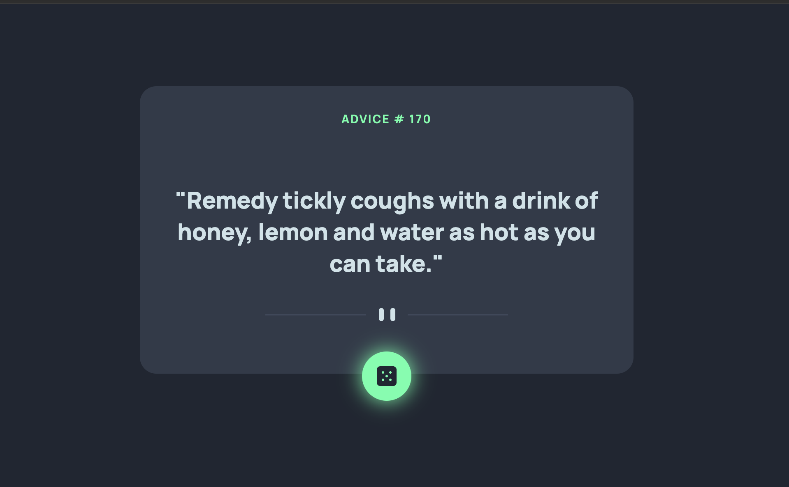

# Frontend Mentor - Advice generator app solution

This is a solution to the [Advice generator app challenge on Frontend Mentor](https://www.frontendmentor.io/challenges/advice-generator-app-QdUG-13db). Frontend Mentor challenges help you improve your coding skills by building realistic projects.

## Table of contents

- [Overview](#overview)
  - [The challenge](#the-challenge)
  - [Screenshot](#screenshot)
  - [Links](#links)
- [My process](#my-process)
  - [Built with](#built-with)
  - [What I learned](#what-i-learned)
  - [Continued development](#continued-development)


## Overview

### The challenge

Users should be able to:

- View the optimal layout for the app depending on their device's screen size
- See hover states for all interactive elements on the page
- Generate a new piece of advice by clicking the dice icon

### Screenshot



### Links

- Live Site URL: [Add live site URL here](https://your-live-site-url.com)

## My process

### Built with

- Semantic HTML5 markup
- CSS custom properties
- Flexbox
- CSS Grid
- Mobile-first workflow
- SASS Preprocessor


### What I learned

In this little project I could put in practice a request to a API and manage the result to visualice correctly in the DOM.

```js
async function generateAdvice() {
  try {
  const response = await fetch('https://api.adviceslip.com/advice')

  if (!response.ok) {
      throw new Error(`Error request`)
      }
  const data = await response.json()
  const {id: adviceId, advice } = data.slip
  
  adviceIdDiv.innerText = adviceId
  adviceContent.innerText = `"${advice}"`

  } catch (error) {
  console.error(`Error:`, error)
  }
}
```

### Continued development

I will continue learning abount API request with library like AXIOS which returns data directly as a JSON.

**Note: Delete this note and the content within this section and replace with your own plans for continued development.**
